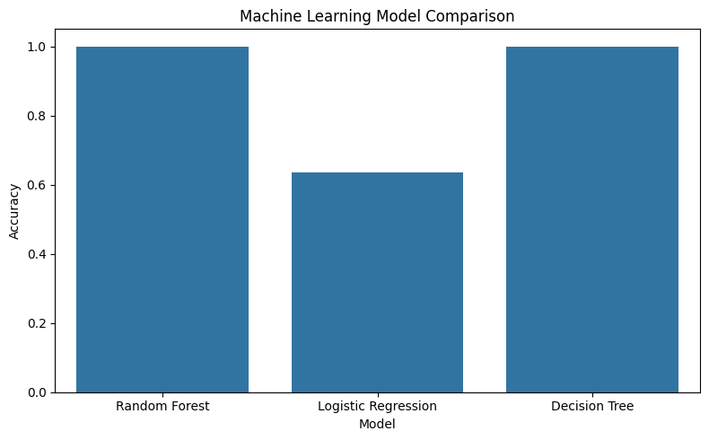
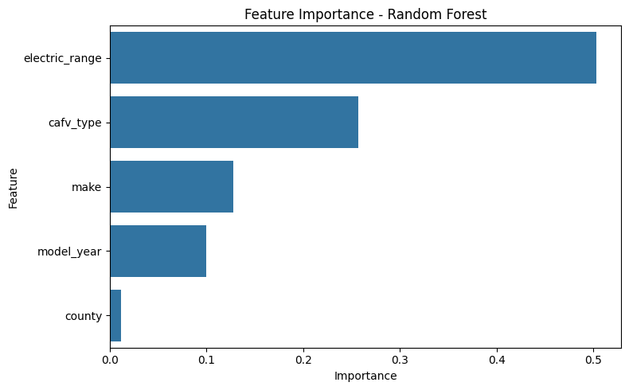
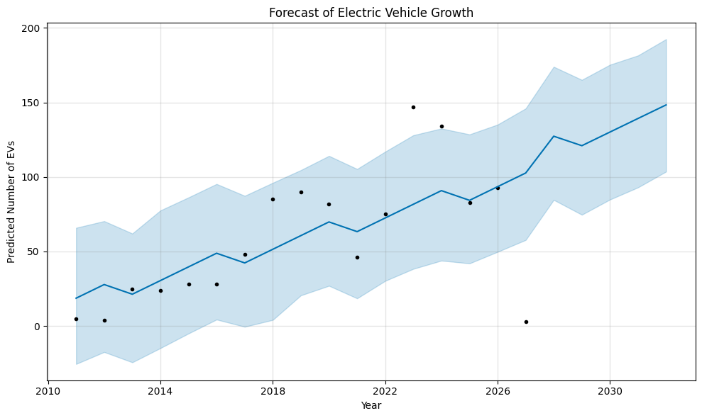
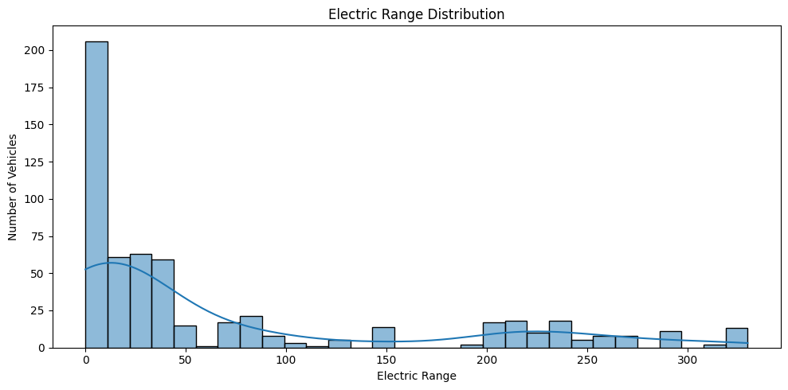

# Machine Learning Analysis and Forecasting of Electric Vehicle Adoption Trends

## Overview

This project analyzes electric vehicle (EV) adoption patterns using exploratory data analysis, machine learning classification, feature importance analysis, and time-series forecasting.

The project was originally developed as part of the **Business Data Analysis (ADA) Master's Program at the University of Bucharest** during the 2025–2026 academic year and was later reorganized into a reproducible GitHub portfolio project.

The analysis focuses on EV records from Washington State and combines descriptive analysis with machine learning models and forecasting techniques to explore patterns in EV type, electric range, manufacturers, model years, and other vehicle characteristics.

## Dataset

The analysis uses the **Electric Vehicle Population Data** published through the Washington State Open Data API.

The dataset is accessed directly from the public API, so the raw dataset does not need to be stored in the repository.

Selected variables include:

* Model year
* Manufacturer
* Electric vehicle type
* CAFV eligibility
* Electric range
* County

For more information about the dataset and how it is used in this project, see [`data/DATA-README.md`](data/DATA-README.md).

## Data Preparation

The preprocessing workflow includes:

* Selecting relevant variables
* Checking for missing values
* Removing incomplete records
* Removing duplicate records
* Encoding categorical variables using `LabelEncoder`
* Separating features and target variables
* Splitting the data into training and testing sets using an 80/20 split

The current reproducible workflow uses the live Washington State Open Data API, meaning results may change over time as the underlying dataset is updated.

## Machine Learning

Three classification models were evaluated:

* Random Forest
* Logistic Regression
* Decision Tree

The target variable is **electric vehicle type**.

### Current Reproducible Results

Using the current version of the public dataset and the preprocessing workflow implemented in this repository:

| Model               | Accuracy |
| ------------------- | -------: |
| Random Forest       |    1.000 |
| Logistic Regression |    0.636 |
| Decision Tree       |    1.000 |

These results are specific to the current dataset retrieved from the API and the methodology implemented in the project.

The original academic analysis produced different accuracy values because the underlying public dataset has changed since the original analysis was conducted.

## Exploratory Analysis

The project includes visual analysis of:

* EV records by model year
* Electric range distribution
* Top EV manufacturers
* Distribution of electric vehicle types
* Feature correlations
* Random Forest feature importance

The feature importance analysis provides an indication of which variables contributed most strongly to the Random Forest classification within this dataset.

## Forecasting

EV adoption was also analyzed using **Prophet** time-series forecasting.

The forecasting workflow:

1. Aggregates EV records by model year
2. Converts the yearly data into a time-series format
3. Trains a Prophet model
4. Generates forecasts for five future periods
5. Visualizes historical and forecasted EV counts
6. Exports the forecast results

The current forecast extends through **2031**.

Forecasting results should be interpreted with caution because the model is based on historical model-year counts and does not incorporate external factors such as:

* Economic conditions
* Government policy
* Charging infrastructure
* Consumer behavior
* Technological developments
* Changes in the automotive market

## Project Structure

```text
ev-adoption-ml-forecasting/
│
├── README.md
├── requirements.txt
├── .gitignore
│
├── data/
│   └── DATA-README.md
│
├── notebooks/
│   └── EV_Adoption_ML_Forecasting.ipynb
│
├── src/
│   ├── data_preprocessing.py
│   ├── classification.py
│   └── forecasting.py
│
├── figures/
│
└── results/
```

## Technologies

* Python
* Pandas
* Scikit-learn
* Matplotlib
* Seaborn
* Prophet
* Jupyter Notebook

## Reproducibility

The project is structured so that the main analysis can be reproduced from the notebook and reusable source modules.

The dataset is retrieved directly from the Washington State Open Data API rather than stored locally in the repository.

The `src/` directory separates reusable preprocessing, classification, and forecasting functions from the exploratory notebook workflow.

Install the required dependencies with:

```bash
pip install -r requirements.txt
```

Then open the notebook:

```text
notebooks/EV_Adoption_ML_Forecasting.ipynb
```

## Limitations

Several limitations should be considered when interpreting the results:

* The dataset represents EV records from Washington State and may not generalize to other regions.
* Model year is used as the temporal variable rather than actual registration or adoption year.
* The classification results depend on the current composition of the public dataset.
* Label encoding is used for categorical variables as part of the original analytical methodology.
* Forecasting is based on historical trends and does not account for external economic, policy, infrastructure, or behavioral factors.
* Longer-term forecasts are subject to greater uncertainty.

## Academic Context

**University of Bucharest**
Faculty of Business and Administration
Master's Program: Business Data Analysis (ADA)
Academic Year: 2025–2026

## Visual Results

### Model Comparison



### Feature Importance



### EV Growth Forecast



### Electric Range Distribution

